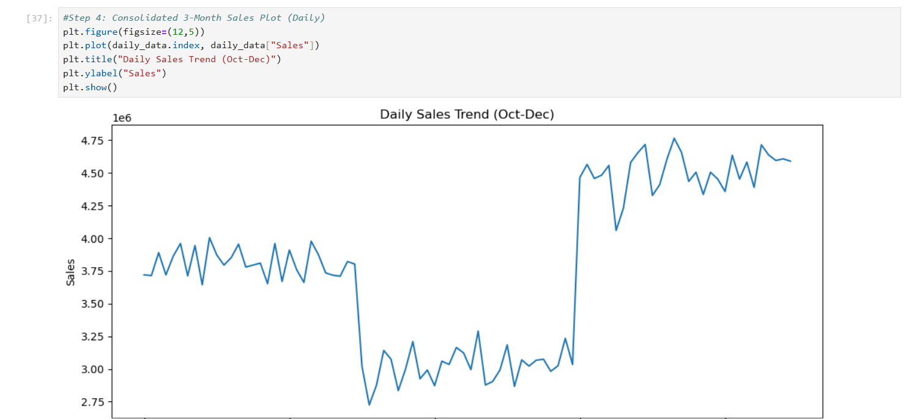

# 🛍️ Retail Sales Analytics

## 📌 Project Overview
This project analyzes retail sales data to uncover purchasing trends, identify high‑performing segments, and provide actionable insights for business decision‑making.  
**Dataset Range:** October – December 2020  

The analysis demonstrates skills in **Python (Pandas, Matplotlib, Seaborn)** and **data storytelling** with clear business impact.

---

## 🛠️ Tools & Technologies
- Python (Pandas, NumPy)
- Data Visualization (Matplotlib, Seaborn)
- Jupyter Notebook
- Data Cleaning & Exploratory Data Analysis (EDA)

---

## 📂 Repository Structure

Retail-Sales-Analytics/
│
├── data/
│ └── Sales.csv
│
├── notebooks/
│ └── retail_sales_analysis.ipynb
│
├── visuals/
│ ├── dual_axis_chart.png
│ ├── sales_boxplot.png
│ └── daily_trend.png
│
├── report/
│ └── Retail_Sales_Insights.pdf
│
├── requirements.txt
└── README.md

---

## 📊 Key Insights
- **Seasonality:** December sales significantly outperformed October and November.  
- **Customer Segments:** Seniors were the most valuable group, especially during evening hours.  
- **Regional Performance:** A few states contributed disproportionately to revenue.  
- **Category Trends:** Certain product categories underperformed, highlighting optimization opportunities.  

---

## 📈 Visual Highlights
- **Dual Axis Chart:** Sales vs. Quantity trend across months.  
- **Boxplot:** Spending patterns by customer type.  
- **Daily Trend Line:** Evening shopping peaks.  
- **State‑wise Sales Chart:** Regional contribution to revenue.  

---

## 🖼️ Sample Visuals
*(Make sure these images exist in your visuals folder)*

  

---

## 📑 Report
A polished PDF report summarizing methodology, visuals, findings, and business recommendations is available in:  
[`report/Retail_Sales_Insights.pdf`](report/Retail_Sales_Insights.pdf)

---

## ⚙️ Requirements
Install dependencies with:

'''bash
pip install -r requirements.txt

🚀 How to Run the Project
1. Clone the repository
2. Install dependencies:
    pip install -r requirements.txt
3. Open Jupyter Notebook:
    jupyter notebook
4. Run retail_sales_analysis.ipynb

---

## 📌 Business Impact
- Replicate December’s promotional strategies to boost sales in other months.
- Target senior evening shoppers for higher returns.
- Focus marketing spend on high‑performing states.

---

## 👤 Author
**Ayushman**

Data Analyst | Skilled in Python, SQL, Tableau, and Business Storytelling

📫 Connect with me: www.linkedin.com/in/ayushman-manav-data-analytics

